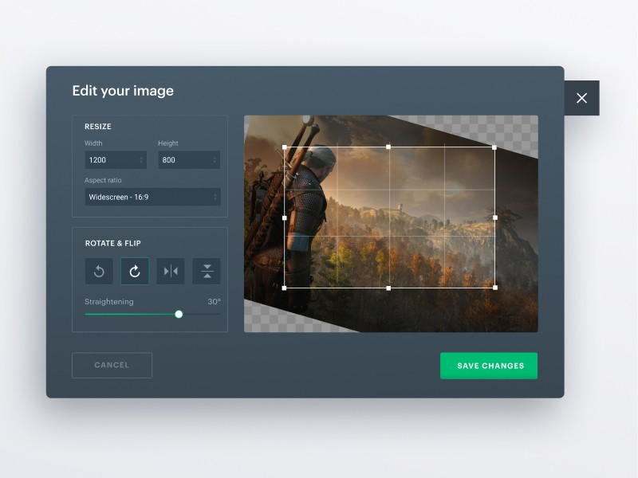
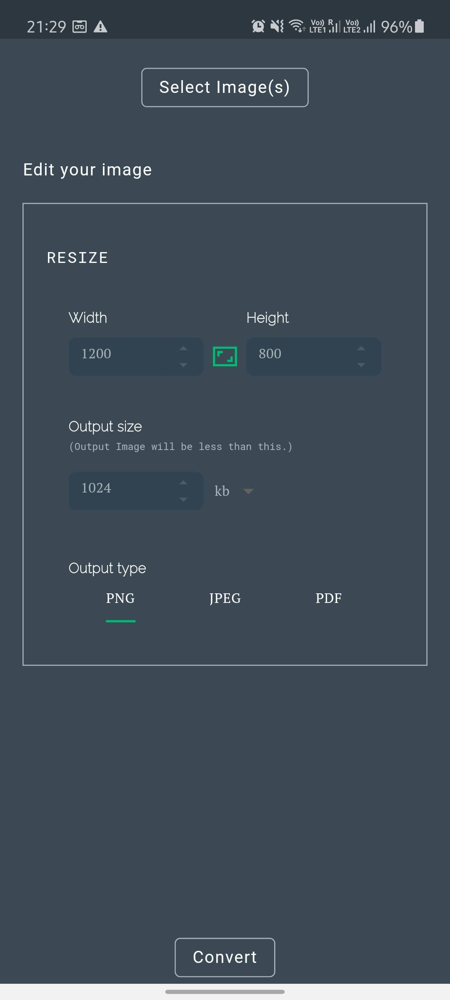
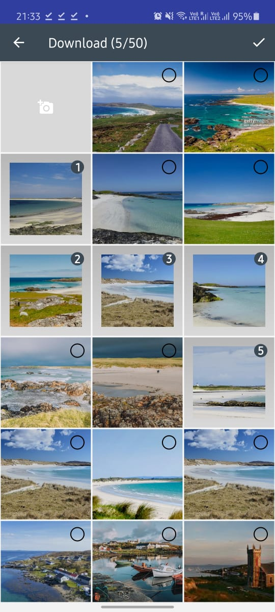
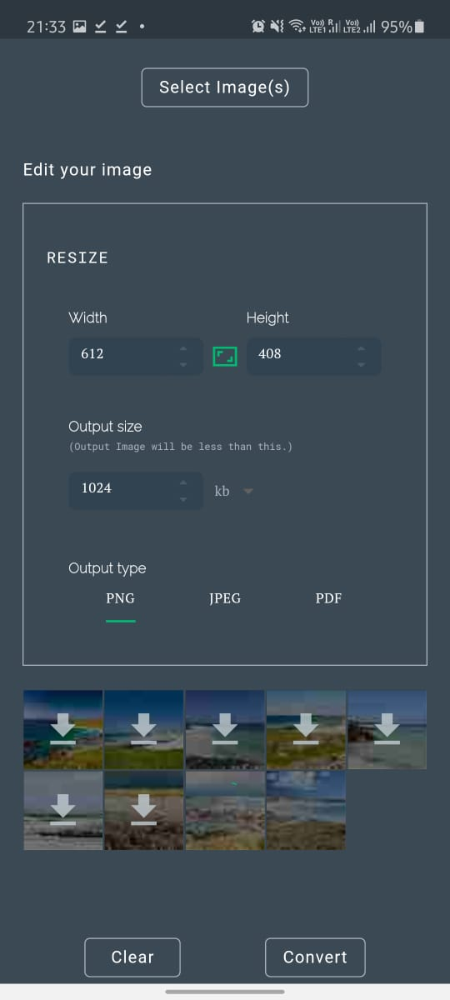
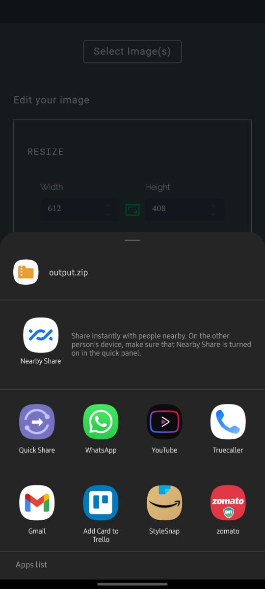

# 🔥🔥 Flutter App Resizer Concept   
Image converter tool which transforms the input image into  given height, width, size and desired file type(png etc).
Concept I found on [dribble](https://dribbble.com/shots/6846135-Image-Photo-Editor).

Star⭐ the repo if you like what you see😉.

<a href="https://play.google.com/store/apps/details?id=com.syed.image_resizer"></img></a>

## ✨ Features

- [x] Binary Search Algo to find optimal size
- [x] Maintain Aspect Ratio Button
- [x] Convertion option based on size, height, width.
- [x] Convertion type to jpg, png, pdfs.
- [x] Share the Output Images/Pdfs.

## ✨ Requirements
* Any Operating System (ie. MacOS X, Linux, Windows)
* Any IDE with Flutter SDK installed (ie. IntelliJ, Android Studio, VSCode etc)
* A little knowledge of Dart and Flutter
* A brain to think 🤓🤓

## 📸 ScreenShots

  
   

  
   

## 🔌 Plugins

| Name                                                    | Usage                                               |
| ------------------------------------------------------- | --------------------------------------------------- |
| [**Provider**](https://pub.dev/packages/provider)       | State Management                                    |
| [**Multi Image Picker**](https://pub.dev/packages/multi_image_picker)      | Display multi image picker on iOS and Android.       |
| [**Flutter Native Image**](https://pub.dev/packages/flutter_native_image)       | Native tools to resize images and reduce their quality                                |
| [**Flutter Archive**](https://pub.dev/packages/flutter_archive)                 | Create and extract ZIP archive files.                      |
| [**Filesize**](https://pub.dev/packages/filesize) | Get human readable file size strings |

## 🤓 Author(s)
**Syed Afshan** 

## 🍴 Readme
Forked from [**Festus Olusegum**](https://github.com/JideGuru)
## 🔖 LICENCE
[WTFPL](http://www.wtfpl.net/about/)
